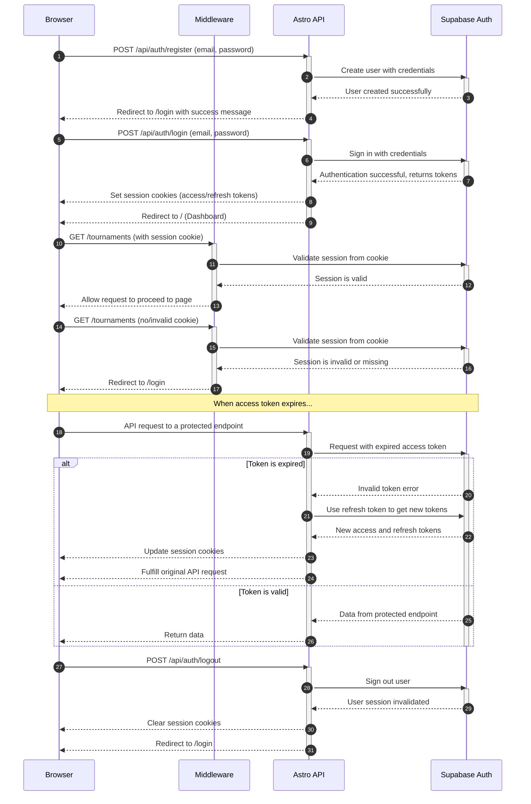

<authentication_analysis>
1.  **Authentication Flows:** The authentication process includes the following user flows:
    -   User registration via an email and password.
    -   User login with credentials.
    -   User logout to terminate the session.
    -   Password recovery for users who have forgotten their password.
    -   Session validation for accessing protected routes.
    -   Automatic token refresh to maintain an active session.

2.  **Actors and Interactions:** The key actors in the system are:
    -   **Browser:** The client-side interface where the user interacts with the application.
    -   **Middleware:** Server-side logic in Astro that intercepts requests to validate user sessions before they reach a protected page.
    -   **Astro API:** A set of server-side endpoints that handle the logic for registration, login, logout, and other authentication-related actions.
    -   **Supabase Auth:** The external authentication provider that manages user identities, sessions, and token issuance.

3.  **Token Verification and Refresh:**
    -   Token verification is handled by the Astro Middleware on every request to a protected page. It inspects the session cookies to ensure the user is authenticated.
    -   The Supabase client library automatically manages token refreshing. When an access token expires, the library uses the securely stored refresh token to obtain a new set of tokens from Supabase Auth without interrupting the user.

4.  **Authentication Step Descriptions:**
    -   **Registration:** The user submits their details, which are sent to the Astro API. The API validates the data and instructs Supabase Auth to create a new user. The user is then redirected to the login page.
    -   **Login:** The user provides credentials, which the Astro API validates against Supabase Auth. Upon success, Supabase issues JWTs (access and refresh tokens), which are stored in cookies, and the user is redirected to the dashboard.
    -   **Accessing Protected Pages:** When a user requests a protected page, the Middleware checks for a valid session in the cookies. If valid, access is granted. If not, the user is redirected to the login page.
    -   **Logout:** A request is sent to the Astro API, which calls Supabase Auth to invalidate the user's session tokens. The session cookies are cleared, and the user is redirected to the login page.
</authentication_analysis>

<mermaid_diagram>

</mermaid_diagram>
