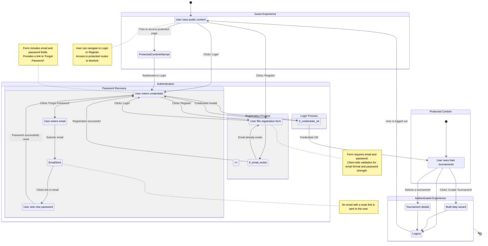

```mermaid
stateDiagram-v2
    [*] --> GuestHomepage

    state "Guest Experience" as Guest {
        GuestHomepage: User sees public content
        note right of GuestHomepage
            User can navigate to Login or Register.
            Access to protected routes is blocked.
        end note
        GuestHomepage --> Login: Clicks 'Login'
        GuestHomepage --> Register: Clicks 'Register'
        GuestHomepage --> ProtectedContentAttempt: Tries to access protected page
    }
    
    ProtectedContentAttempt --> Login: Redirected to Login

    state "Authentication" as Auth {
        state "Login Process" as LoggingIn {
            Login: User enters credentials
            note left of Login
                Form includes email and password fields.
                Provides a link to 'Forgot Password'.
            end note
            Login --> if_credentials_ok <<choice>>
            if_credentials_ok --> Dashboard: Credentials OK
            if_credentials_ok --> Login: Credentials Invalid
            Login --> ForgotPassword: Clicks 'Forgot Password'
            Login --> Register: Clicks 'Register'
        }

        state "Registration Process" as Registration {
            Register: User fills registration form
            note right of Register
                Form requires email and password.
                Client-side validation for email format and password strength.
            end note
            Register --> if_email_exists <<choice>>
            if_email_exists --> Login: Registration successful
            if_email_exists --> Register: Email already exists
            Register --> Login: Clicks 'Login'
        }

        state "Password Recovery" as Recovery {
            ForgotPassword: User enters email
            ForgotPassword --> EmailSent: Submits email
            note right of EmailSent
                An email with a reset link is sent to the user.
            end note
            EmailSent --> ResetPassword: Clicks link in email
            ResetPassword: User sets new password
            ResetPassword --> Login: Password successfully reset
        }
    }

    state "Authenticated Experience" as Authenticated {
        Dashboard: User sees their tournaments
        Dashboard --> CreateTournament: Clicks 'Create Tournament'
        Dashboard --> ViewTournament: Selects a tournament
        CreateTournament: Multi-step wizard
        ViewTournament: Tournament details
        
        Dashboard --> Logout
        CreateTournament --> Logout
        ViewTournament --> Logout
    }

    Logout --> GuestHomepage: User is logged out
    
    state "Protected Content" as ProtectedContent {
        [*] --> Dashboard
    }
    
    Authenticated --> [*]
```
